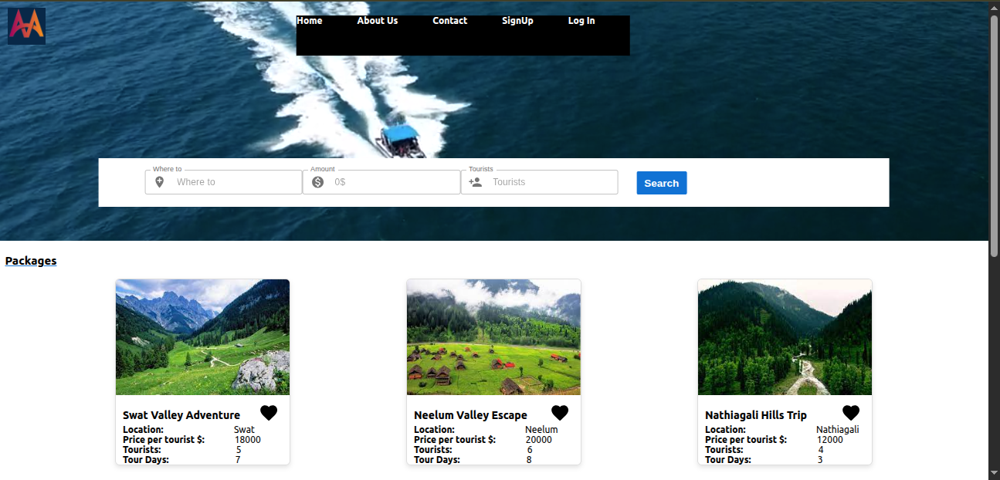

# Muhammad Hassan Obaid Portfolio

Welcome to MuhammadHassanObaidPortfolio – a customizable personal dev portfolio + blog template built using GatsbyJS, TailwindCSS, and enhanced with Sass, JavaScript, and Gulp. It's lightweight, responsive, and production-ready – just plug in your info and you're live! 🚀

🚀 Live Demo of portfolio [clickHere]()
📁 GitHub Repository(https://github.com/mhassanobaid/portfolio.git)

✨ Features
⚙️ Built with GatsbyJS + TailwindCSS

💡 Gulp-ready (compile Sass + minify JS)

🎨 Sass variables for easy theming

📱 Fully responsive

🧱 Bootstrap grid included

🧰 Font Awesome support

🧼 Clean, modular file structure

📦 Folder Structure
pgsql
⚙️ Setup and Configuration
1. 🔧 Customizing the Template
bash
Copy
Edit
# Clone the repository
git clone https://github.com/mhassanobaid/portfolio.git
cd portfolio

# Install dependencies
npm install

# Run Gulp to compile Sass and minify JS
npm run watch  # OR gulp watch

# OR compile once manually
npm run styles

Make edits in:

sass/styles.scss → compiled to css/styles.css

js/scripts.js → minified to js/scripts.min.js

2. 🏃‍♂️ Using the Template As-Is
Just copy the following to your server or GitHub Pages:

css/, images/, js/, libs/

index.html

Then edit index.html with your info and you're good to go!

🎨 Customization Guide
🎯 General Styles
Edit your primary styles in sass/_variables.scss:

scss

$base-color: #3498db;
$background: #fff;
$heading: #374054;
$text: #74808a;

🧩 Page Sections
🔝 Header
Add/remove navigation links in the <header> tag.

Sticky Header:

html

<header class="sticky"> ... </header>
External Links:

html

<a href="https://google.com" class="no-scroll">Google</a>
👋 Lead Section
Update your name, title, and resume link:

html

<h1>Muhammad Hassan Obaid</h1>
<h2>Software Engineer</h2>
<a href="images/Muhammad_Hassan_Obaid_Resume.pdf" download="Hassan_Resume.pdf" class="btn-rounded-white">Download Resume</a>
👤 About Section
Just edit the paragraph with your bio.

💼 Experience Section
Vertical timeline using #experience-timeline:

html

  <h3>Blackstack Software Solutions</h3>
  <h4>Full stack Developer</h4>
  
Built secure and scalable systems...

🎓 Education Section
html
Copy
Edit

  <h3>University of South Asia</h3>
  2020 – 2024
  <h4>Bachelor of Science in Software Engineering</h4>
  
CGPA: 3.55

💻 Projects Section
html

  

    
  

  

    <h3>Adventure Ace Tour management System</h3>
    
Community-driven role-based tour management portal

    <a href="https://github.com/mhassanobaid/FypProj">View Project</a>
  

Add "Show More Projects" toggle:

html

<a id="view-more-projects" href="#">View More Projects</a>

...

🧠 Skills Section
List your tech stack and tools in this section.

📬 Contact Section
Includes your email, phone number, and social links.

🔚 Footer Section
Add copyrights.

🧪 Gulp Tasks
bash

gulp watch    # watches and compiles SCSS + JS
gulp styles     # compile Sass manually
gulp js       # minify JS manually
📝 License
This project is licensed under the MIT License – feel free to use and modify it for personal/commercial purposes.

🙌 Acknowledgements
Inspired by RyanFitzgerald’s portfolio templates

Images from Unsplash

Icons by Font Awesome

Want to collaborate or suggest a feature?
📧 Contact: ahmedhassan9145@gmail.com
🔗 GitHub Profile
